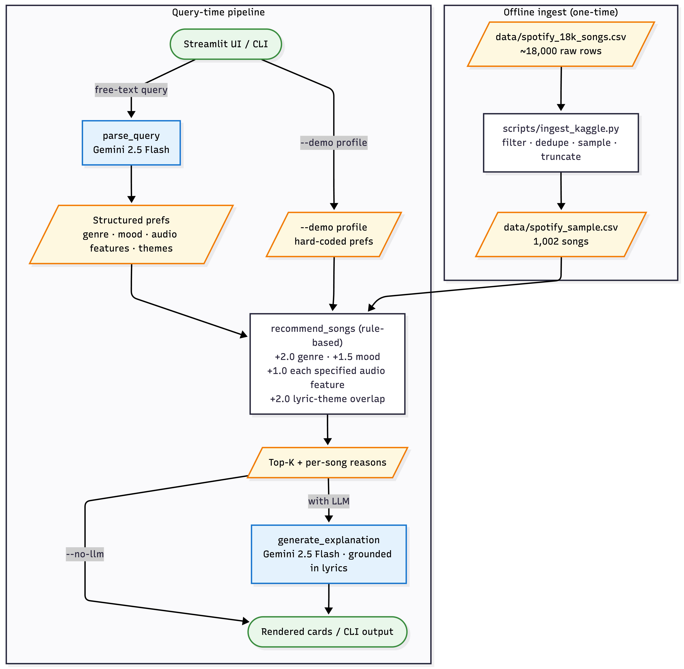
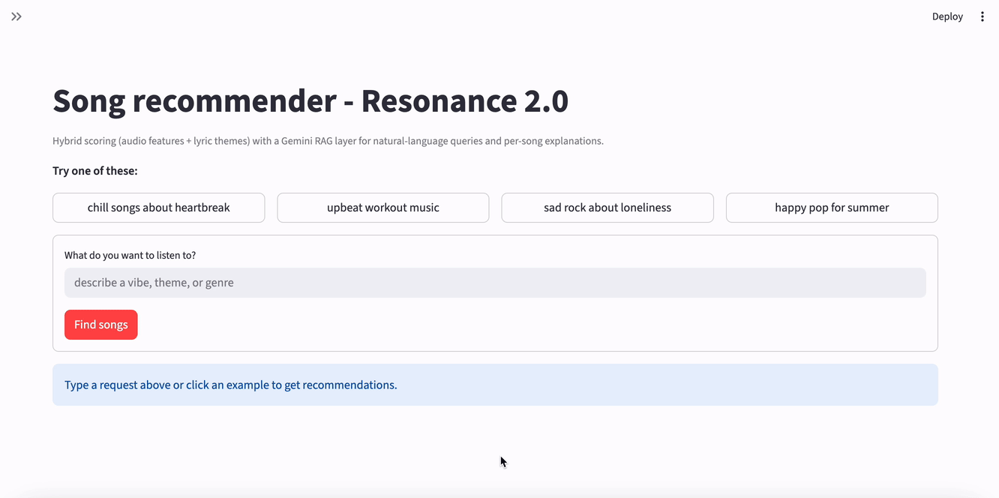
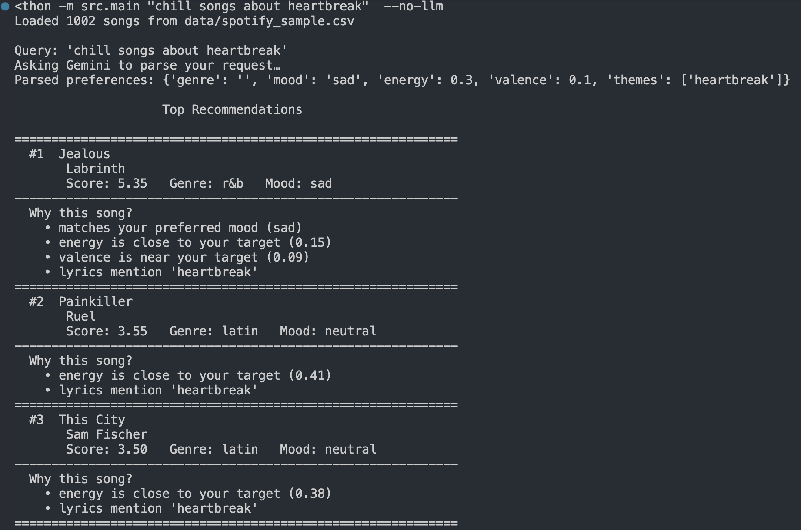
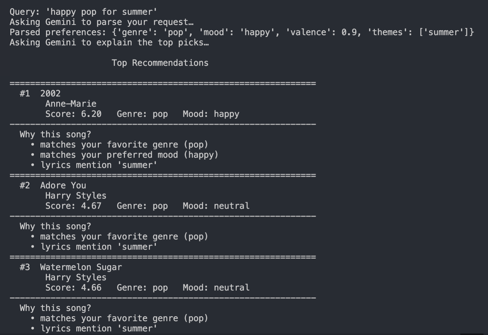
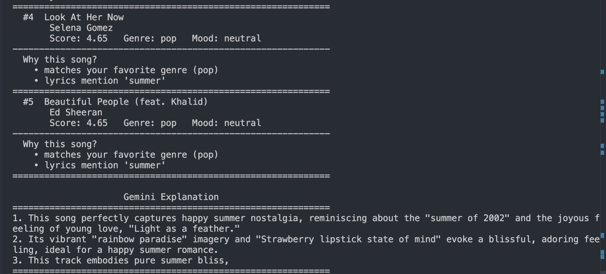
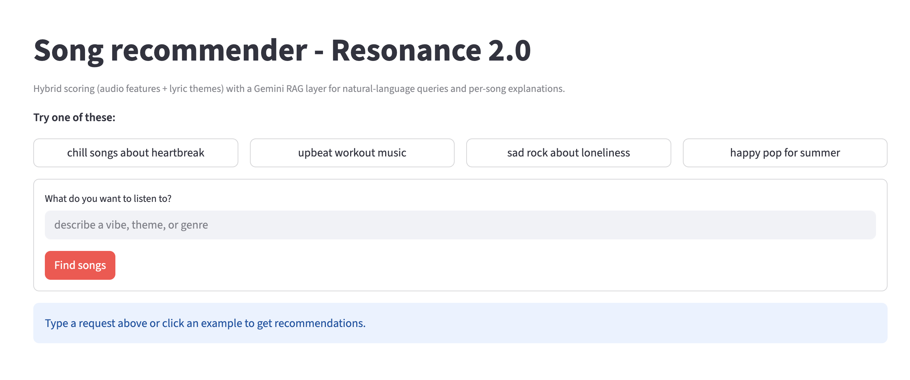
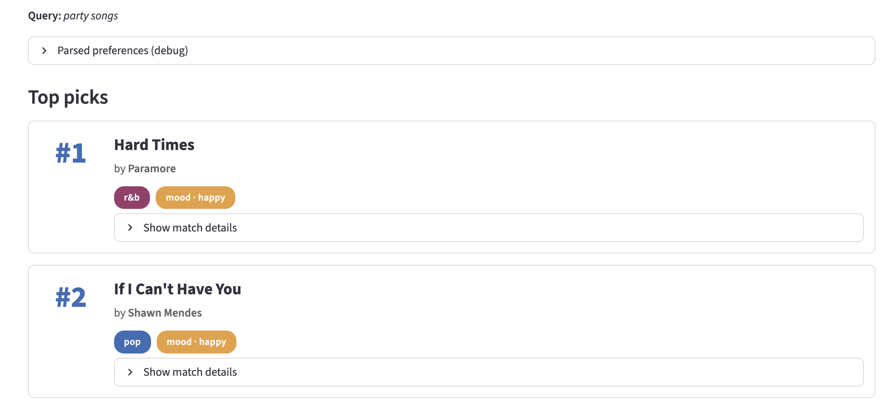
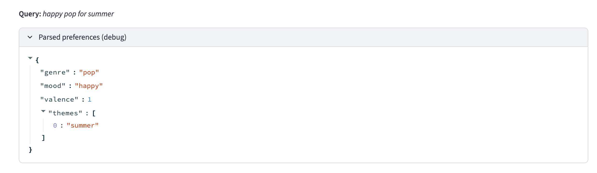
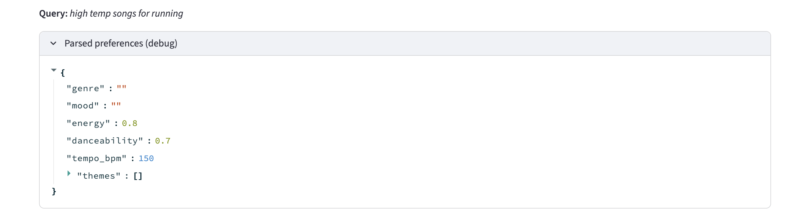
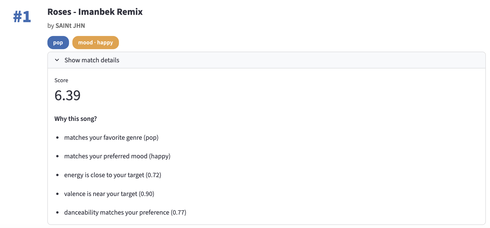

# 🎵 RAG Song Recommender

## Project Summary

Resonance 2.0 is a song recommender that takes a free-text request — "chill songs about heartbreak", "upbeat workout music", "sad rock about loneliness" — and returns a ranked list of songs from a curated Spotify catalog with one-sentence explanations grounded in each track's lyrics.

The system pairs a small, transparent rule-based scorer with a Gemini RAG layer. Gemini 2.5 Flash converts the user's natural-language query into a structured preference profile (genre, mood, target audio features, lyric themes), the scorer ranks the 1,002-song catalog against that profile, and Gemini writes per-song blurbs that quote from each track's lyrics excerpt to explain why it fits.

This is the second iteration based on project 3. Resonance 1.0 required the user to fill out a numeric profile (favorite genre, target energy, target tempo, ...) and matched against 20 hand-curated songs without lyrics. Resonance 2.0 keeps the same readable scoring formula but adds three things: natural-language input, a 50× larger catalog of real Spotify tracks with lyrics, and a lyric-theme matching component so a query like "songs about heartbreak" actually surfaces heartbreak songs — not just sad-sounding ones.

## How The System Works

The system diagram is shown below:


The system runs in two phases. 
- Offline, scripts/ingest_kaggle.py takes the raw ~18K-song Kaggle dataset, filters to English tracks with non-null lyrics, dedupes on (track_name, track_artist), keeps the top-167 by popularity per genre for a balanced 1,002-song catalog, derives a coarse mood label from valence, and truncates each lyric to 500 characters — producing data/spotify_sample.csv. 
- Online, when a user submits a free-text query, src/rag.py:parse_query sends it to Gemini 2.5 Flash and gets back a structured JSON profile (genre, mood, audio-feature targets, and lyric themes — with unspecified features left as null). Those prefs flow into src/recommender.py:recommend_songs, a deterministic rule-based scorer that ranks every catalog song by combining genre/mood matches, audio-feature proximity, and lyric-theme substring overlap. The top-K and their per-song reasons are returned to the caller; if the user opted in, src/rag.py:generate_explanation makes a second Gemini call to write one-sentence blurbs grounded in each song's lyrics excerpt. The Streamlit UI (or CLI) renders the final ranked list. 

### Scoring formula

Each song accumulates points (max ≈ 10.5):

| Component | Points | When applied |
|-----------|--------|--------------|
| Genre matches user's genre | +2.0 | binary |
| Mood matches user's mood | +1.5 | binary |
| Energy proximity | up to +1.0 | only if user specified energy |
| Acousticness proximity | up to +1.0 | only if user specified acousticness |
| Valence proximity | up to +1.0 | only if user specified valence |
| Danceability proximity | up to +1.0 | only if user specified danceability |
| Tempo proximity | up to +1.0 | only if user specified tempo |
| Lyric-theme overlap | up to +2.0 | only if Gemini extracted lyric themes |

Audio features are scored only when the user actually specified them. Gemini returns `null` for features it can't infer from the query, and the scorer treats absent features as no-signal rather than penalizing songs that drift from a default.

The lyric-theme component lower-cases each Gemini-extracted theme (e.g. `["heartbreak", "moving on"]`) and checks for substring presence in each song's `lyrics` column. The fraction of themes that match becomes the per-song lyric score.

### Key components

| Component | Role | Library |
|-----------|------|---------|
| Ingest | Sample the 18K Kaggle CSV down to a balanced 1,002-song catalog | `pandas` |
| Recommender | Rule-based scoring + lyric-theme overlap | stdlib |
| Query parser | Natural language → structured prefs (JSON) | `google-genai` (Gemini 2.5 Flash) |
| Explanation writer | Per-song blurb grounded in lyrics excerpts | `google-genai` (Gemini 2.5 Flash) |
| UI | Search, results, Gemini blurbs | `streamlit` |
| Tests | Recommender + parser unit tests | `pytest` |

### Catalog schema

`data/spotify_sample.csv` has one row per song:

- `id` — sequential integer
- `title`, `artist` — canonical Spotify metadata
- `genre` — one of `pop`, `latin`, `rap`, `r&b`, `rock`, `edm`
- `mood` — coarse bucket from valence: `happy` (≥ 0.6) / `sad` (≤ 0.4) / `neutral`
- `energy`, `acousticness`, `valence`, `danceability` — Spotify audio features in `[0, 1]`
- `tempo_bpm` — clipped to `[0, 200]` BPM
- `popularity` — Spotify popularity score, `[0, 100]`
- `lyrics` — first 500 characters, whitespace-collapsed

## Getting Started

### Setup

1. Create a virtual environment (optional but recommended):

   ```bash
   python -m venv .venv
   source .venv/bin/activate      # Mac or Linux
   .venv\Scripts\activate         # Windows
   ```

2. Install dependencies:

   ```bash
   pip install -r requirements.txt
   ```

3. Get a Gemini API key from https://aistudio.google.com/apikey, then copy `.env.example` to `.env` and paste your key:

   ```bash
   cp .env.example .env
   # edit .env, replace `your_key_here` with your actual key
   ```

   The free tier of Gemini 2.5 Flash is sufficient for casual use of this app.

4. Download the source dataset and build the catalog:

   - Get the Kaggle dataset titled [**"Audio features and lyrics of Spotify songs"**](https://www.kaggle.com/datasets/imuhammad/audio-features-and-lyrics-of-spotify-songs?select=spotify_songs.csv) (~18,000 English-language tracks with audio features + lyrics) and place the CSV at `data/spotify_18k_songs.csv`.
   - Run the ingest script to produce `data/spotify_sample.csv`:

     ```bash
     python scripts/ingest_kaggle.py
     ```

### Running the Streamlit app

```bash
streamlit run app.py
```

The app loads the catalog, exposes a sidebar with a results-count slider and a Gemini-blurbs toggle, and offers four example queries you can click. Each result is rendered as a card with the song's title/artist, colored genre and mood badges, and a collapsed "Why this song?" reasons including lyric-theme matches, a normalized score bar, and a lyrics excerpt.

### Running the CLI

```bash
python -m src.main "chill songs about heartbreak"          # natural-language query
python -m src.main "..." --no-llm                          # skip Gemini explanation
python -m src.main --demo high_energy_pop                  # run a hard-coded demo profile
python -m src.main --csv data/songs.csv "..."              # use the small fixture catalog
python -m src.main "..." --k 10                            # return 10 results
```

### Running the tests

```bash
pytest
```

Tests cover the recommender (sorted top-K, null-default features, theme overlap, missing-lyrics handling, out-of-bounds clamping) and the JSON post-processing in `parse_query` (Gemini client monkey-patched, no network).

---

## Experiments To Try

| Query | What it tests |
|-------|---------------|
| `chill songs about heartbreak` | Lyric theme overlap (`themes=["heartbreak"]`) + low-energy preference |
| `upbeat workout music` | Pure-audio query (`themes=[]`) — exercises feature scoring without lyric pollution |
| `sad rock about loneliness` | Genre + mood + lyric theme stacking |
| `happy pop for summer` | Genre + mood with optional lyric theme |
| `intense rap about overcoming adversity` | Cross-genre theme retrieval |

What to watch in the "Parsed preferences" debug expander:

- Which features Gemini set vs. left `null`. Most queries leave 2–4 audio features unset.
- Which themes Gemini extracts. Themes drive lyric matching directly.
- When `themes=[]`, the system falls back to pure audio matching — exactly what you want for "upbeat workout music".

---

## App walkthrough:



---

## Output details:
- Example of CLI output (no_llm):



- Example of CLI output (with_llm):




- Example of Streamlit UI output:




- Example of parsed preferences details:




- Example of match details card:



---

## Limitations and Risks

- **Catalog is small and English-only.** 1,002 songs across 6 genres, all English-language. Less-represented languages, regions, and niche genres are absent.
- **Mood is a 3-bucket function of valence.** Hard thresholds at 0.4 and 0.6 mean two songs at valence 0.59 and 0.61 land in different buckets despite being nearly identical, and "neutral" is a catch-all.
- **Lyric matching is substring-only.** "heartbreak" matches "heartbreaks" and "heartbroken" (substring catches morphology by accident), but it does not catch synonyms ("loss", "betrayal") or songs that are *about* heartbreak without using the word. Most synonym work happens upstream when Gemini canonicalizes the query into themes.
- **Genre and mood labels are coarse.** "pop" covers Carly Rae Jepsen to Lewis Capaldi; "rock" covers Queen to Imagine Dragons. Sub-genre nuance is not represented.
- **Lyric truncation.** First 500 characters means the bridge / outro of long songs is invisible to both the theme matcher and the explanation generator.
- **LLM hallucination risk in explanations.** `generate_explanation` is grounded in the lyrics excerpt, but Gemini can still produce blurbs that emphasize attributes not actually salient in the song. The retrieval and ranking are auditable; the explanations are not.
- **No personalization.** No listening history, no like/dislike feedback, no per-user adaptation. Two users with the same query get the same results.
- **No diversity enforcement.** Top-K can contain multiple songs by the same artist or with very similar feature profiles.
- **Cost and latency.** Each query with Gemini enabled is two API calls (parse + explain). The free tier of Gemini 2.5 Flash (~10 RPM, ~250 RPD at time of writing) covers casual use. With `--no-llm` only the parse call is made; with `--demo` profiles, no API calls happen at all.

---

## Reflection

Read the full model card:

[**Model Card**](model_card.md)

The headline difference between Resonance 1.0 and Resonance 2.0 is *where the structure lives*. In 1.0, the user supplied the structure: a numeric profile filled in by hand. In 2.0, Gemini supplies the structure: a JSON profile parsed out of a free-text request. The recommender itself stayed almost identical — same genre/mood bonuses, same feature-proximity score, same human-readable explanations — and that's the point. The LLM's job is translation, not ranking. Keeping the ranker rule-based means a song's score is auditable to a single line of code, which makes it possible to debug bad results instead of shrugging at a black-box index.

The lyric-theme component is the smallest piece of the system and the one that punches the hardest. Without it, "songs about heartbreak" matches on parsed `mood=sad` and `valence=0.2` — which gets you sad songs, but not necessarily ones whose lyrics are about heartbreak. With it, every song's lyrics are checked against Gemini's extracted themes, and substring hits contribute up to +2.0 (on par with a genre match). It is one cheap way of a possible RAG retrieval — no embeddings, no vector store, just `theme.lower() in lyrics.lower()` — and for a 1,002-song catalog whose theme list already passed through Gemini's semantic canonicalization, but it gets close to the quality of a heavier embeddings approach without the API cost.
